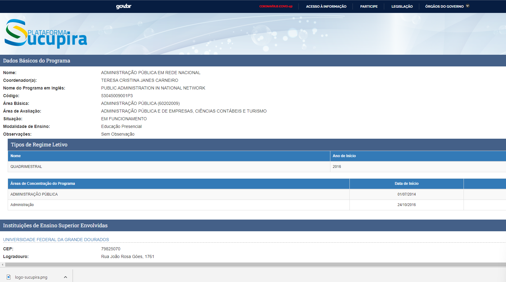

# Scrapping Portal Sucupira
Web scraping related to the collection of data from the sucupira portal with address, courses and other information.
[](https://github.com/paulonneves/sucupira-scrapy/issues)
[](https://github.com/paulonneves/sucupira-scrapy/network)
[](https://github.com/paulonneves/sucupira-scrapy/stargazers)
[](https://github.com/paulonneves/sucupira-scrapy/pulls)
[](https://github.com/paulonneves/sucupira-scrapy/stats/contributors)

## Description
In the basic data section there is coordination information and details of the teaching modality.
The address, email and official website of the university are listed below.
Finally, there is information on undergraduate and graduate courses, in addition to normative acts.
The objective is to obtain and group this contact information in relation to the study programs on the sucupira platform.

## requirements
* Python 3.7+
* Install Pip and setup ```pip install -r requirements.txt```

## View Portal
[acesse aqui o website portal](https://sucupira.capes.gov.br/sucupira/public/consultas/coleta/programa/viewPrograma.jsf?popup=true&cd_programa=53045009001P3)



## Output
* Json data

```
{
    "Nome": [
        "ADMINISTRAÇÃO PÚBLICA EM REDE NACIONAL"
    ],
    "Nome do Programa em Inglês": [
        "PUBLIC ADMINISTRATION IN NATIONAL NETWORK"
    ],
    "Área Básica": [
        "ADMINISTRAÇÃO PÚBLICA (60202009)"
    ],
    "Área de Avaliação": [
        "ADMINISTRAÇÃO PÚBLICA E DE EMPRESAS, CIÊNCIAS CONTÁBEIS E TURISMO"
    ],
    "Situação": [
        "EM FUNCIONAMENTO"
    ],
    "Modalidade de Ensino": [
        "Educação Presencial"
    ],
    "Observações": []
    .
    .
    .
}  
```